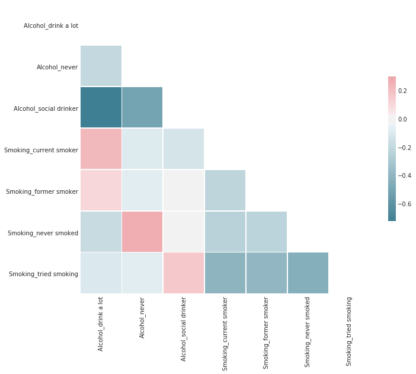
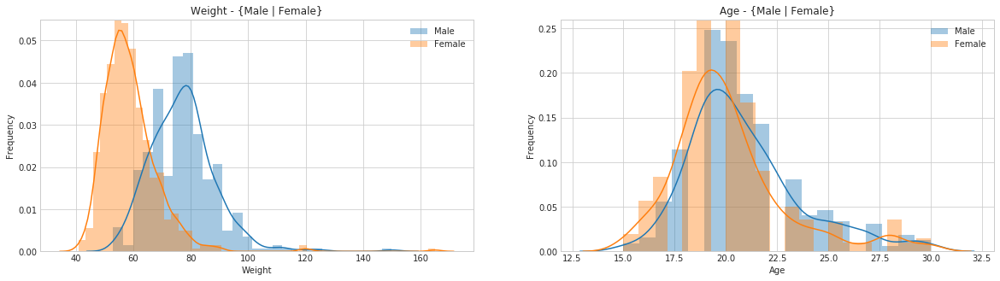
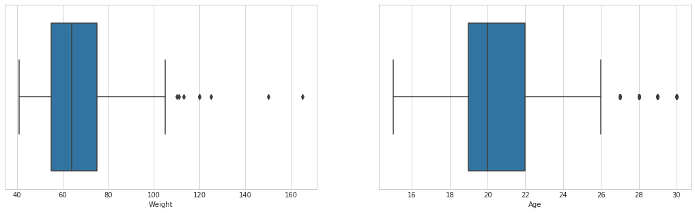
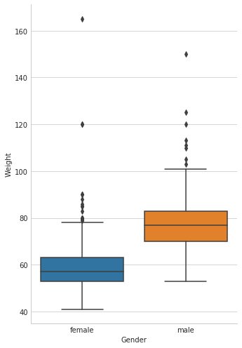
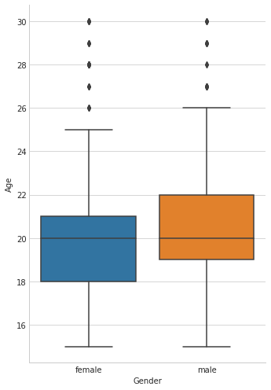

<h1><b>Análisis y visualización de datos</b></h1>
<h4>Diplomatura AACSyA 2018 - FaMAF - UNC</h4>
<h3>Mario Ferreyra | Emiliano Kokic</h3>

# **Laboratorio 2 - Comunicación de Resultados**
---
## Variables más correlacionadas y posibles interpretaciones
Vamos a analizar diferentes variables del Dataset sobre la respuestas de gente joven a una encuesta.

Las primeras variables a considerar son el Peso (Weight) y la Edad (Age), veamos que tan correlacionadas estan:
* General: Corr(Peso, Edad) = 0.237722

Luego, si consideramos las subdivisiones por genero:
* Hombres: Corr(Peso, Edad) = 0.253514
* Mujeres: Corr(Peso, Edad) = 0.156477

Se nota que en general estan directamente correlacionadas, pero no tanto.  
En el caso de los hombres es ligeramente mayor que el de las mujeres.
Con esta informacion, se espera que el aumento o disminucion del peso sea proporcional respecto
a la edad. (Mas aun en el caso de los hombres).

Otras variables son el Consumo de Alcohol (Alcohol) y Tabaco (Smoking).  
Destaquemos las siguientes caracteristicas de estas variables de tipo categoricas:
* Alcohol
    - Categorias: 'never', 'drink a lot', 'social drinker'
    - Personas que respodieron: 1005
    - Categoria mas usada (moda): 'social drinker'
    - \# Categoria mas usada: 659

* Smoking
    - Categorias: 'never smoked' 'tried smoking' 'former smoker' 'current smoker'
    - Personas que respodieron: 1002
    - Categoria mas usada (moda): 'tried smoking'
    - \# Categoria mas usada: 430

Demos un vistazo a las correlaciones:

Un hecho notable que nos brinda la correlacion entre estos elementos categoricos es que aquellas personas
que son fumadores activos tambien son, en general, grandes consumidores de alcohol.

Por otro lado, hay una fuerte tendencia de que aquella persona que nunca ha fumado tampoco haya bebido alcohol.

**Nota:** Adjunto a este informe se encuentra el archivo [TestChi2](TestChi2.ipynb) en el cual se utiliza el test de chi-cuadrado para analizar la independencia de las variables categoricas Smoking y Drinking.

---
## Distribución de los ejemplos con respecto a una clase

Veamos el comportamiento de las distribuciones correspondientes a las clases Peso y Edad subdivididas por genero:

En ambos casos son distribuciones normales.

Respecto a la distribucion del peso, se puede observar que las mujeres tienden a tener un peso menor al de los hombres en la mayoria de los casos.

Distinto es el caso de la distribucion de las edades entre los hombres y mujeres, en el cual se asemejan bastante. Es decir, tenemos una muestra mayormente equitativa en terminos de la edad por genero.

---
## Análisis de outliers

Hagamos una analisis de los valores atipicos (outliers) de las variables Peso y Edad.  
Miremos los siguientes diagramas de cajas de estas variables:

De cada diagrama, podemos sacar las siguientes conclusiones:
* Peso: los valores atipicos que escapan a la distribucion del peso, son aquellos que estan por encima de los 110 Kg. aproximadamente.
* Edad: los valores atipicos que escapan a la distribucion de la edad, son aquellos que estan por encima de los 27 años aproximadamente.
* Haciendo un conteo de la cantidad de valores que superan los limites de los outliers del peso y edad, son pocos los jovenes que superan los 110 Kg en un rango de edad que normalmente no supera los 26 años.

Ahora bien, si desglosamos estas variables por genero obtenemos los siguientes diagramas:

 

Vemos que en la variable Peso hay una mayor dispersion en las mujeres que en los hombres, mientras que en la edad son distribuciones mucho mas parecidas.
